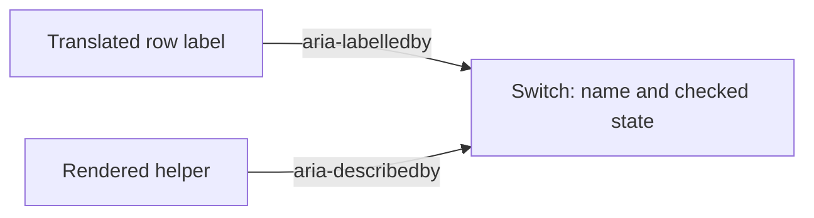

# Preferences switch names

Status: implemented
Translation: current

[中文版](2026-10-01-preferences-switch-names.zh.md)

## Abstract

Four Preferences switches had visible labels but no accessible names, so a
screen reader could expose their state without identifying the preference.
The controls now reference the existing translated row labels and, where
present, their helpers. This restores semantics without changing notification
authorization, archive defaults, or preference storage. Chromium regression
coverage uses isolated preferences and a synthetic notification service;
native screen-reader speech and production notification delivery remain unverified.

## Evidence and decision

At main `7d502f3d99fdcdbbdd43d032c6d903d4ed497e04`, the four switches appeared
unnamed in Chromium's accessibility tree. Both English and Chinese browser
tests failed to locate the code-only switch by its visible name. Relevant PR
searches found no effective existing fix.

`CompactRow` rendered labels as paragraphs beside controls. Switch IDs alone
provided no label association, and the archive controls had no association
either. This is a semantic defect in the
[existing row grammar](../feature/2026-09-26-settings-row-grammar.md), not a
change to product intent.

`CompactRow` exposes optional text-node IDs; the four consumers use
`aria-labelledby`, and code-only/notification helpers use `aria-describedby`.
React `useId` keeps label references local to each mounted instance. Notification
description references disappear when there is no helper. Explicit association
avoids copying translations into a second label or automatically naming every
control in a multi-control row. Existing Switch keyboard behavior and
`aria-checked` remain owned by `@lody/ui`.

## Verification and limits

The [browser suite](../../../../packages/components/tests/e2e/preferences-accessibility.spec.ts)
mounts the real Preferences component through an isolated
[Storybook fixture](../../../../packages/components/src/stories/GeneralSettings.stories.tsx).
It checks English and Chinese names, helper descriptions, unchanged off defaults,
Tab order, Space/Enter state changes, and the notification loading/remount path.
External HTTPS requests are blocked; the enabled notification cases replace only
the notification service module with a synthetic asynchronous permission result.

On Node 26.10.0, all four browser cases pass; the existing auto-launch and PR
archive suites pass all 11 tests. Component typecheck, formatting, static/public
boundary checks, and docs check pass. Full `pnpm check` stops at the unrelated
`boot-shell` storage-unavailable test (4590 component tests pass, one fails).
That failure also reproduces independently with its source and test unchanged
from main; subsequent Electron tests in the root command did not run.

These tests establish browser semantics and UI state, not spoken output from
VoiceOver/NVDA, packaged Electron behavior, real permission dialogs, or delivery.
No production account or preference was used. Repository check results are
recorded in [Draft PR #1191](https://github.com/LodyAI/Lody/pull/1191).
