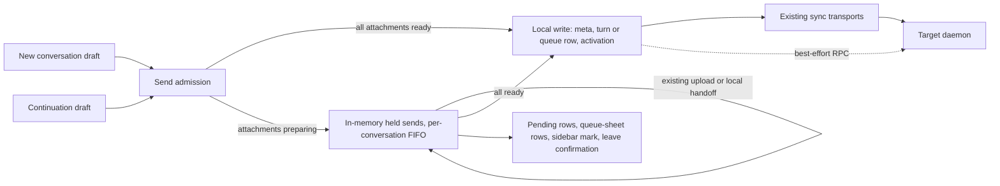

# Attachment drafts and pending messages

Status: draft
Translation: current

[中文](session-files.zh.md)

## Abstract

- **Attachments are drafts until Send, in new conversations and continuations alike.** Picking, dropping or pasting validates and previews locally only. Attachments can be removed or replaced, and existing transfer starts on Send.
- **A ready message is accepted locally at once.** Its history turn or queue row and its activation metadata are written as local commits before any network confirmation. The dispatch or steer request is only a fast path. The daemon starts pending turns from synchronized history.
- **A message whose attachments are still preparing is held in memory only.** Nothing reaches the synchronized document until every attachment is ready. A failure keeps the whole message for retry or cancellation. Sends to the same conversation keep their order; different conversations progress independently.
- **Losing a held message on page exit is accepted.** Closing, crashing, reloading or disposing the workspace runtime during an upload loses that message. The only protection is a leave confirmation: `beforeunload` in the page, and one native Stay/Leave confirmation in Electron for close, reload and quit.
- **Archive, delete, logout, cache clearing and workspace switching never wait for sends.** Archive and delete cancel the held sends of their targets. The other actions are not gated.
- **This PR owns the draft lifecycle only.** It reuses existing upload, local handoff, fallback and backfill semantics. Original-path references and permanent zero upload belong to a [separate follow-up](local-attachment-references.md). A paste over 500 KiB becomes a non-editable `text/plain` attachment named `pasted-text.txt`. This Spec is draft; packaged-device acceptance is outstanding.

## 1. Scenario and scope

On the new-conversation landing or in an existing conversation, the user adds attachments and reviews or edits the draft before sending. After Send, the conversation opens (or stays open) immediately. A message without attachments to prepare appears as an ordinary turn or queue row. A message with attachments still preparing appears as a pending user-message row with per-attachment progress. It is written only once every attachment is ready.

Navigating between conversations inside the same page keeps held sends working. Leaving the page (close, reload, external navigation, crash) or disposing its workspace runtime ends them. Attachment services may receive files first, but the Agent never sees a message before all its attachments are ready.

Scope: new conversations, continuations including child conversations, images, ordinary files and attachment-only messages, on desktop and mobile layouts. The public desktop keeps its [platform boundary](../packages/platform/AGENTS.md). Excluded: OS background transfer, cross-device sync of unsent drafts, recovery of held sends after the page ends, editable text-file controls, a new image editor, and original-path references.

| This PR                                                                                                   | Separate follow-up                                                                                       |
| --------------------------------------------------------------------------------------------------------- | -------------------------------------------------------------------------------------------------------- |
| Draft validation/preview, transfer after Send, in-memory holding, progress, retry/cancel, ordered writing | Original local paths, permanently local generated attachments, new reference protocol, Daemon resolution |

## 2. Behavior replaced by this design

| Earlier behavior                                                                                 | Current intent                                                                         |
| ------------------------------------------------------------------------------------------------ | -------------------------------------------------------------------------------------- |
| Transfer on addition; failed ordinary files silently filtered                                    | Transfer after Send; every attachment must be ready                                    |
| A crash-durable IndexedDB send journal with staged records, Blob persistence and window recovery | Local CRDT commits for ready sends; in-memory holding for sends awaiting attachments   |
| Archive, logout, cache clearing, reload and quit gated on unfinished sends                       | Archive/delete cancel held sends; other actions are ungated; only a leave confirmation |
| A renderer–main send-lifecycle handshake before Electron quit                                    | Quit closes product windows with unload approval before stopping relays or the CLI     |

The renderer authors messages through WorkspaceWriter / SessionData / HistoryWriter. Keep the [single history writer](session-history-writes.md); no second history path.

## 3. Responsibilities and ownership



| Responsibility                                                     | Owner                                                                 |
| ------------------------------------------------------------------ | --------------------------------------------------------------------- |
| Text, mention spans, references, attachment order, pre-send edits  | Composer draft                                                        |
| Holding, preparing, ordering, retrying and canceling unready sends | The workspace runtime's in-memory held-send queue                     |
| Upload or existing local handoff                                   | Existing platform transports returning existing `SessionInputBlock`s  |
| History/queue/activation writes                                    | WorkspaceWriter / SessionData, as local commits                       |
| Starting a written turn                                            | The daemon's dispatch watcher, from synchronized history and metadata |
| Leave protection                                                   | Page `beforeunload`; Electron main's native confirmation              |

Held sends belong to one workspace runtime. They are not part of any shared Session Doc and are never persisted. Progress, File/Blob objects, object URLs and tokens stay out of synchronized messages.

## 4. Attachment draft lifecycle

### 4.1 Addition, editing, and leaving the composer

Pick/drop/paste only checks type, count, empty files, and existing size limits, retaining File/Blob sources and bounded local previews. Show “Pending upload” or “Pending preparation” for existing local paths. Do not upload, hash the full file, invoke local handoff, or use executable pending history/queue rows as draft storage.

Users may remove attachments or replace draft sources before Send. Invalid attachments must not remain as silently omitted inputs. Revoke unused object URLs on removal/replacement while preserving data owned by another draft or held send. Navigating away from a conversation or landing and returning preserves attachments, text, references, and ordering within the same scope; restoring names without usable File/Blob data is insufficient.

Changing target/configuration updates the draft and necessary validation without triggering upload. Removing all attachments before Send creates no transfer. Pasted text that fits the 500 KiB UTF-8 ceiling keeps the existing inline or folded behavior; text above that ceiling becomes the ordinary non-editable `pasted-text.txt` file draft. No new text-file editor or image-editing UI is added.

### 4.2 Reuse existing transfer after Send

After Send, retain existing platform/target routing to upload or local handoff. Use current results and SessionInputBlock types, without new local-path references. Legacy `transport: local` readiness means the target can use the attachment through its existing path; it does not promise permanent zero upload.

Cloud readiness requires a valid final response; 100% byte transfer while server verification remains pending is not ready. Existing local handoff uses its current success response. Existing fallback remains capability-gated. UI must not represent local preparation using fictional network-upload percentages.

Only explicit successful attachment results become ready. Failure/cancellation cannot become success by filtering attachments. Retry reuses confirmed results and retries only failed ones. Cancellation stops cooperative transfers, and a late completion cannot write the message.

## 5. New-conversation and continuation flows

| Stage                 | New conversation                                                                                  | Continuation                                                               |
| --------------------- | ------------------------------------------------------------------------------------------------- | -------------------------------------------------------------------------- |
| Send                  | Freeze input/configuration and reuse the reserved session ID; the draft clears                    | Freeze this turn's input/configuration/target; the draft clears            |
| Attachments preparing | An in-memory placeholder conversation is openable and listed; the user may start another draft    | A pending row appears; the user may navigate or draft the next message     |
| All ready             | Creation metadata, then the first turn, written locally with the same IDs                         | The turn (or queue row) written locally with the same ID                   |
| Failure               | Creation parameters, text and all attachments stay held with the error; retry keeps the same IDs  | The original target and input stay held; retry never rereads another view  |
| Cancel before writing | The held send is dropped; no empty session is written; later held sends inherit its creation data | Only this held send is dropped; the Agent and existing queue are untouched |

Both entry points use the same admission and preparation. A ready send (including one whose attachments were already prepared) is written at once, unless an earlier held send of the same conversation exists. New-session warmup that cannot outlive the upload is canceled; the actual send may cold-start.

## 6. Takeover, states, and ordering

### 6.1 Send boundary

After synchronously excluding double submission, freeze text, mention spans, references, attachment order, creation parameters, target, Role/revision, model/mode/permissions, MCP selection (including an explicit empty array), and delivery intent. Later edits cannot change a frozen send. Archive and deletion of the target are rechecked when it is written. Preserve click-time mobile keyboard dismissal. Old asynchronous callbacks cannot clear a newer draft.

The latest locally held send supplies the composer's temporary run-config and Role
baseline, including before a new conversation's empty document hydrates. Explicit
edits for the next draft take precedence; a runtime snapshot for an older turn does
not. The same turn ID fences the held send and its eventual history/queue row, so
writing it cannot consume newer draft edits or flash provider defaults. Failure
keeps the baseline. Cancellation releases it without overwriting user edits; a newer
durable turn supersedes it. Runtime disposal and session changes isolate the baseline.

### 6.2 Minimal message states

| State                        | Meaning and actions                                                            |
| ---------------------------- | ------------------------------------------------------------------------------ |
| Preparing                    | Hash, upload/local handoff or server verification; cancelable                  |
| Waiting for previous message | An earlier held send of the same conversation has not been written; cancelable |
| Failed                       | Not written; the whole message stays held for retry or cancellation            |
| Written                      | Local commits exist; synchronization and daemon execution follow on their own  |
| Canceled                     | Only before writing; a late preparation result cannot revive it                |

Byte progress and server verification are separate. Within one workspace runtime, each conversation writes in Send order, including later text-only messages. A failed held send blocks the ones behind it until it is retried or canceled. Different conversations progress independently.

### 6.3 Direct, queue, and guide

Held sends are separate from the daemon message queue. Before attachments are ready, neither executable history nor queue rows serve as placeholders.

- **Direct**: write the turn and point `latestUserMsgId` at it (never behind a newer local user turn; never for archived or deleted conversations), then send a best-effort dispatch request without waiting for Repo persistence. A request failure is not a send failure.
- **Queue**: write the queue row. A queue-bound held send renders as a display-only local row at the end of the queue sheet, not in the conversation stream. It offers only retry and cancel, and is replaced by the real row with the same turn ID.
- **Guide**: write the turn as `pending_apply`, then offer it to the target assistant turn.
  - Applied: the turn is marked processing with applied-steer provenance.
  - Proven non-delivery (`no-active-turn` or `promotion-failed` without `recoveryOwned`, or a request that provably cannot be sent because the target is cloud-routed and the browser is offline): the same turn becomes an ordinary pending follow-up and is activated.
  - `recoveryOwned`: the daemon owns the turn; the renderer does nothing more.
  - Uncertain (unknown delivery, timeout, transport error): the turn is left as written, never replayed, and not shown as a send failure.
- **Native queue steer** writes `pending_apply` history with the queue item's `userTurnId`, removes the queue row, then steers.

Applied steers follow the [history contract](session-history-writes.md) and never execute again as ordinary messages.

## 7. Submission identity and local writes

Each send has a fixed turn ID from Send onward; queue rows carry it as `userTurnId`. Retry never generates a new ID. A new conversation keeps its reserved session ID.

The local write is the accept boundary. Creation metadata comes first and writes absent keys only, so later edits win. The turn or queue row follows, then activation for direct sends. Repo persistence and transport upload run independently: accepting a send and issuing its RPC do not wait for a Repo-wide flush or network confirmation. Local acceptance alone does not guarantee crash durability before background persistence completes. The daemon dispatches `pending`/`seen` user turns it finds in synchronized history, so a written turn needs no renderer retry loop. A dispatch acknowledgment is acceleration, not proof of execution.

Local acceptance, synchronization and daemon execution are distinct facts. UI must not present local acceptance as daemon receipt.

## 8. Presentation and leave protection

| Surface/stage       | Presentation                                                                                          |
| ------------------- | ----------------------------------------------------------------------------------------------------- |
| Composer            | Draft attachments before Send; remove or replace before Send                                          |
| Held, preparing     | The pending user-message row says it is waiting to send; each attachment carries its own progress     |
| Server verification | Distinguished from byte transfer, even at 100%                                                        |
| Failed              | The affected attachment carries its reason; the message offers Retry and Cancel                       |
| Written             | An ordinary turn or queue row; a ready send shows no pending state unless it waits behind a held send |
| Desktop sidebar     | One status mark for held sends (sending or failed); a held new conversation's title stays muted       |

Use i18n and accessible status names. Subscribe to progress per affected row, not the whole list. Completion never navigates.

### 8.1 Browser and application navigation

While the page holds any send (preparing, waiting or failed), install `beforeunload`. Call `preventDefault()` and set a compatible `returnValue`. Remove it when none remain. Browsers control the dialog text and may not fire it (notably on mobile). Conversation switches and panel closes that keep the runtime do not prompt. Workspace switching, logout, cache clearing and application-driven reload are not gated; disposing the runtime cancels its held sends.

### 8.2 Electron

Main surfaces any renderer `beforeunload` veto on a product window (close, reload, quit) as one native Stay/Leave confirmation. Leave ignores that veto only. Quit closes product windows one at a time, main window last, so each gets unload approval before main destroys relays or stops the CLI. Stay cancels quit with everything running; windows already closed stay closed. The same confirmation covers the unsaved-editor guard. Never destroy a normally closing window or bypass unrelated `beforeunload` guards.

## 9. In-memory holding, accepted loss, and cleanup

Held sends live only in renderer memory, per workspace runtime. They are never written to IndexedDB or any other store. If the page closes, crashes or reloads, or the runtime is disposed, before a held send is written, **that message is lost**. This is an accepted trade-off, not a defect. There is no recovery surface after restart.

Archive and delete never throw about pending messages. They cancel the held sends of their targets, including held child creations whose parent is a target. They join any in-flight write, so a canceled send never writes afterwards. Archiving a conversation that exists only as a held creation cancels it and writes nothing. Written history may synchronize with archive state but must not launch work in an archived conversation.

Cancellation or writing releases the held send's source data once no preview still uses it. Committed attachment storage keeps its existing lifecycle. Upload cancellation promises not to write the message, not immediate deletion of temporary remote bytes.

Clearing the local cache deletes the retired `lody-session-send-v1` database. For one release, forced-clear flags written by older builds are still honored.

**Legacy migration.** Once per runtime, after the first metadata sync and under a cross-window lock, leftover records from the retired journal for the current account and workspace are handled as follows:

- A record whose turn is absent is written as an ordinary local send. Version-2 `committed` records are never appended again, because a fresh replica may simply not have synchronized them.
- Direct records and never-offered guides are activated and dispatched on a best-effort basis. A guide already offered to the daemon is left untouched.
- A record with unprepared attachments is dropped with a warning.
- Handled rows are deleted, failed rows are retried at the next start, and the database is deleted once empty.

This migration is temporary and will be removed after a few releases.

## 10. Acceptance criteria

These are acceptance requirements, not tests completed by this revision. Use synthetic files, controllable Promises and explicit signals, not sleeps.

| ID  | Trigger                                                                                          | Observable result                                                                                                       |
| --- | ------------------------------------------------------------------------------------------------ | ----------------------------------------------------------------------------------------------------------------------- |
| A01 | Pick, paste or drop images/files before Send                                                     | No upload, full hash or local handoff; validation and preview work                                                      |
| A02 | Send A with attachments, navigate to B, then A's preparation finishes                            | Only A is written; B's draft and navigation remain; a new-conversation placeholder is reachable                         |
| A03 | One of two attachments succeeds, or transfer completes but verification is pending               | Nothing is written to history or the queue; the failed file is not omitted                                              |
| A04 | Double Send, repeated Retry, completion after cancellation                                       | One write per message; canceled work never writes                                                                       |
| A05 | Attachment message A fails, then text B to the same conversation; conversation C is healthy      | B waits while C is written; B is written after A is retried or canceled                                                 |
| A06 | Change Role/model/permissions/MCP/text after Send                                                | The held send keeps its frozen configuration                                                                            |
| A07 | New-conversation attachments, leave and return to landing, send, start another draft             | Draft restored; the original session ID is kept; completion preserves the newer draft                                   |
| A08 | Draft in A, switch to B and back, send A and type the next message                               | Isolated drafts; A's completion keeps the next input and needs no mounted composer                                      |
| A09 | Image-only, file-only, mixed, or text plus attachments, in both entry points                     | Type/count/order/text/references preserved; written only when all ready                                                 |
| A10 | Remove/replace attachments or change target before Send; empty or oversized input                | No automatic transfer; final draft used; visible errors, no silent omission                                             |
| A11 | Retry or cancel a failed held send, including a held first message followed by another held send | Only failed attachments retry; canceling the first hands creation data to the next; no empty session is written         |
| A12 | Ready send while the target is offline or its RPC fails                                          | The turn and activation are written locally; the send is not reported as failed                                         |
| A13 | Guide answered applied, proven non-delivery, `recoveryOwned`, or uncertain                       | Processing; follow-up with the same ID; nothing; left as written and not replayed                                       |
| A14 | Archive or delete a conversation with a held send, a held child creation, or an in-flight write  | Held sends are canceled; nothing is written after the action resolves; no error about pending messages                  |
| A15 | Close, reload or quit with a held send (browser and Electron, including an auxiliary window)     | One confirmation; Stay keeps everything running; Leave loses the held send                                              |
| A16 | Logout, cache clearing, or workspace switch with a held send                                     | Not gated; held sends are dropped; cache clearing deletes the retired journal database                                  |
| A17 | Start with leftover legacy journal records                                                       | Absent turns written once; offered guides untouched; unprepared records dropped; empty database deleted                 |
| A18 | Existing upload/local handoff, fallback and legacy local data                                    | Only transfer timing changes; attachment types, fallback/backfill and materialization unchanged                         |
| A19 | Send with a non-default model, edit the next draft, then finish/fail/cancel the upload           | Composer keeps the held configuration until superseded; next-draft edits survive history/queue handoff and cancellation |

The [finite model](models/session-files.model.ts) checks only declared draft gates, readiness, ordering and state decisions. It does not establish browser lifecycle or real Agent behavior. Final acceptance includes packaged Electron, browsers and native mobile.

## 11. Effect TS integration and implementation order

### 11.1 Scope

The workspace uses the repository-pinned **Effect 3.18.4** only inside its send-resource owner (`sendResources`): attachment preparation, cancellation and store borrows. Components keep ordinary Promise interfaces; React/Jotai keep drafts and view state. Held sends are a plain in-memory queue, not an Effect service, and have no persistent state.

### 11.2 Lifetime

```text
one workspace runtime
├─ sendResources scope → preparation attempts, short store borrows
└─ held-send queue (memory) → prepare → local write → best-effort RPC
CLI Agent / backfill: separate owners, not renderer children
```

Disposing the runtime aborts held sends, cancels and joins cooperative I/O, settles noncancelable IPC, then closes caches and transports. A late result after disposal cannot write.

### 11.3 Cancellation and retry

Cancellation stops cooperative I/O, including image XHR and multipart cleanup. A noncancelable Electron read/IPC settles before its dependency is released, and its late result cannot write or fall back. One part-retry layer exists. Whole writes and steers are never retried automatically.

### 11.4 Staged adoption

Four stacked PRs shipped the submission boundary (#705), resource ownership (#707), a durable submission journal (#709) and send-time attachment preparation (#719). The durable journal was later removed in favor of this design; see the [decision](../.agents/notes/implemented/simplification/2026-09-29-remove-session-send-journal.md). The [Effect probes](models/session-files.effect-probe.mjs) cover Promise interruption, signals, Scope cleanup, generations and two store-ref-tracker cases with synthetic stores. They do not establish product integration.

## 12. Evidence and verification status

- **Intended behavior**: this Spec (draft; not human-approved). Decision history: [deferred attachment design](../.agents/notes/implemented/architecture/2026-09-14-deferred-attachment-send.md) and [removing the send journal](../.agents/notes/implemented/simplification/2026-09-29-remove-session-send-journal.md).
- **Inspected implementation** (`packages/components/src/` unless noted): `lib/{session-send-delivery,session-send-admission,session-submission,session-pending-sends,legacy-session-send-migration,session-attachment-preparation,session-send-resources,clear-local-cache}.ts`; `providers/workspace-pending-sends.ts`; `components/chat/session-pending-sends-host.tsx`; `apps/electron/src/main/renderer-unload.ts`; CLI dispatch in `apps/cli/src/session/session-dispatch-logic.ts`.
- **Executed validation**: component behavioral suites for these modules; results are recorded in the PR. No packaged desktop, real multi-window network or native mobile acceptance has been run.
- Related explanations: [CLI attachment lifecycle](../.agents/docs/cli-lib-session-files.md), [composer/run configuration](../.agents/docs/sessions-run-config.md). Platform references: [browser beforeunload limits](https://developer.mozilla.org/en-US/docs/Web/API/Window/beforeunload_event), [Electron will-prevent-unload](https://www.electronjs.org/docs/latest/api/web-contents#event-will-prevent-unload).
