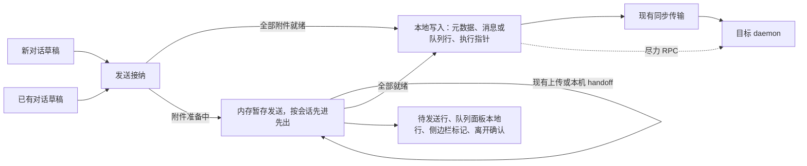

# 附件草稿与待发送消息

Status: draft
Translation: current

[English](session-files.md)

## 摘要

- **新对话和已有对话中，附件在点击发送前都是草稿。** 选择、拖入或粘贴只做本地校验和预览；附件可以移除或替换，点击发送后才启动现有传输。
- **就绪的消息立即在本地接受。** 历史消息或队列行以及执行元数据会先作为本地提交写入，不等待任何网络确认。dispatch 或 steer 请求只是快速路径；daemon 会从已同步的历史启动待处理消息。
- **附件仍在准备的消息只暂存在内存中。** 全部附件就绪前，不向同步文档写入任何内容。失败时保留整条消息，可重试或取消。发往同一会话的消息保持顺序，不同会话各自推进。
- **接受页面退出时丢失暂存消息。** 上传期间关闭、崩溃、重新加载页面或销毁工作区运行时，这条消息会丢失。唯一的保护是离开确认：页面中的 `beforeunload`，以及 Electron 中覆盖关闭、重新加载和退出的一个原生“留下/离开”确认。
- **归档、删除、登出、清缓存和切换工作区都不等待发送。** 归档和删除会取消目标会话的暂存发送；其他操作不受拦截。
- **本 PR 只负责草稿生命周期。** 复用现有上传、本机 handoff、fallback 和 backfill 语义；原路径引用和永久零上传属于[独立后续工作](local-attachment-references.zh.md)。超过 500 KiB 的粘贴会变成不可编辑的 `text/plain` 附件 `pasted-text.txt`。本文为 draft，打包设备验收尚未完成。

## 1. 场景与范围

用户在新对话输入页或已有对话中添加附件，发送前可检查和修改草稿。点击发送后，对话立即打开（或保持打开）。没有待准备附件的消息显示为普通消息或队列行；附件仍在准备的消息显示为待发送的用户消息行，每个附件显示各自进度，全部附件就绪后才写入。

在同一页面内切换会话时，暂存发送继续进行。离开页面（关闭、重新加载、外站跳转、崩溃）或销毁其工作区运行时会结束它们。附件服务可以先收到文件，但所有附件就绪前 Agent 绝不会看到这条消息。

范围：新对话、已有对话继续发送（含子会话）、图片、普通文件和纯附件消息，覆盖桌面和移动布局。公开桌面端继续遵守[平台边界](../packages/platform/AGENTS.md)。不包括：系统级后台传输、未发送草稿的跨设备同步、页面结束后恢复暂存发送、可编辑文本文件控件、新图片编辑器以及原路径引用。

| 本 PR                                                                    | 独立后续工作                                                             |
| ------------------------------------------------------------------------ | ------------------------------------------------------------------------ |
| 草稿校验/预览、发送后传输、内存暂存、进度、重试/取消、按顺序写入         | 本机原路径、永久本地的生成附件、新引用协议、Daemon 解析                  |

## 2. 本设计替代的行为

| 以前的行为                                                                  | 当前意图                                                           |
| --------------------------------------------------------------------------- | ------------------------------------------------------------------ |
| 添加即传；失败的普通文件被静默过滤                                          | 发送后传输；所有附件都必须就绪                                     |
| 可跨崩溃恢复的 IndexedDB 发送日志，含分阶段记录、Blob 持久化与跨窗口恢复     | 就绪发送写入本地 CRDT 提交；等待附件的发送暂存在内存中             |
| 存在未完成发送时拦截归档、登出、清缓存、重新加载和退出                      | 归档/删除取消暂存发送；其他操作不拦截；只保留离开确认              |
| Electron 退出前渲染进程与主进程之间的发送生命周期握手                       | 退出时先关闭产品窗口并取得离开许可，然后才停止 relay 和 CLI        |

渲染进程经 WorkspaceWriter / SessionData / HistoryWriter 写用户消息。继续沿用[唯一历史 writer](session-history-writes.zh.md)，不引入第二条历史写入路径。

## 3. 职责与数据归属



| 责任                                         | 归属                                                  |
| -------------------------------------------- | ----------------------------------------------------- |
| 文字、mention spans、引用、附件顺序与发送前编辑 | 输入框草稿                                            |
| 暂存、准备、排序、重试和取消未就绪的发送     | 工作区运行时的内存暂存队列                            |
| 上传或已有本机 handoff                       | 现有平台传输，返回现有 `SessionInputBlock`            |
| 历史/队列/执行指针写入                       | WorkspaceWriter / SessionData，作为本地提交           |
| 启动已写入的消息                             | daemon 的 dispatch watcher，读取已同步的历史和元数据  |
| 离开保护                                     | 页面 `beforeunload`；Electron 主进程的原生确认        |

暂存发送属于某个工作区运行时，不属于任何共享 Session Doc，也从不持久化。进度、File/Blob、object URL 和 token 不写入同步消息。

## 4. 附件 draft 生命周期

### 4.1 添加、修改与离开输入框

选择、拖入或粘贴时，只检查类型、数量、空文件和现有大小限制，保存 File/Blob 与有界本地预览，显示“待上传”（已有本机传输路径可显示“待准备”）。不启动上传、全量 hash 或本机 handoff，也不将可执行的 pending history/queue 当草稿存储。

发送前可移除附件或替换草稿来源；失败校验不得留下会被静默忽略的附件。移除、替换后释放不再使用的 object URL，不释放其他草稿或暂存发送仍使用的源数据。切换会话或暂时离开 landing 再返回，同一作用域内的附件、文字、引用与顺序仍在，不能只恢复附件文件名而丢失 File/Blob。

发送前改变目标或运行配置只更新草稿并重新做必要校验，不自动上传。未点发送就移除全部附件，不产生传输任务。符合 500 KiB UTF-8 上限的粘贴继续使用原有的行内或折叠行为；超过上限的粘贴变成普通的不可编辑 `pasted-text.txt` 文件草稿。不新增文本文件编辑器或图片编辑 UI。

### 4.2 发送时复用现有传输

点击发送后，按既有平台与目标选择上传或本机 handoff；复用上传结果和已有 SessionInputBlock，不新加本地路径引用类型。旧 `transport: local` 就绪仍表示该目标可按旧链路使用附件，不表示永久不上传。

云端上传需要最终有效响应，传输 100% 仍在服务端校验不能 ready。本机 handoff 按现有响应判断就绪；原有 fallback 仍受平台 capability 限制。UI 不能把本机准备伪装成网络上传百分比。

只有明确的附件成功结果才算就绪；失败/取消不能通过过滤附件变成成功。重试复用已确认结果，只重新处理失败的附件。取消会停止可配合的传输，晚到的完成结果不能写入消息。

## 5. 新对话与已有对话流程

| 阶段           | 新对话                                                                     | 已有对话                                                     |
| -------------- | -------------------------------------------------------------------------- | ------------------------------------------------------------ |
| 点击发送       | 冻结输入/配置并沿用预留 session ID；草稿清空                               | 冻结本轮输入/配置/目标；草稿清空                             |
| 附件准备中     | 内存中的占位会话可打开并显示在列表中；用户可开始另一份草稿                 | 出现待发送行；用户可切换会话或编写下一条消息                 |
| 全部就绪       | 用相同 ID 在本地先写创建元数据，再写首条消息                               | 用相同 ID 在本地写入消息（或队列行）                         |
| 失败           | 创建参数、文字和所有附件连同错误保持暂存；重试沿用相同 ID                  | 原目标和输入保持暂存；重试绝不读取其他正在查看的会话         |
| 写入前取消     | 丢弃该暂存发送，不写入空会话；后续暂存发送继承其创建数据                   | 只丢弃这条暂存发送，不影响 Agent 和现有队列                  |

两个入口使用同一套接纳与准备流程。就绪的发送（包括附件已准备好的）立即写入，除非同一会话存在更早的暂存发送。无法撑过上传过程的新会话预热会被取消，实际发送可以冷启动。

## 6. 接管、状态与顺序

### 6.1 点击发送的边界

同步排除重复提交后，冻结文字、mention spans、引用、附件顺序、创建参数、目标、Role/revision、model/mode/permissions、MCP 选择（包括显式空数组）以及投递意图。之后的编辑不能改变已冻结的发送。写入时重新检查目标是否已归档或删除。保留点击时收起移动端键盘的行为。旧的异步回调不能清空更新的草稿。

### 6.2 最小消息状态

| 状态             | 含义与操作                                                     |
| ---------------- | -------------------------------------------------------------- |
| 准备中           | hash、上传/本机 handoff 或服务端校验；可取消                   |
| 等待前一条消息   | 同一会话更早的暂存发送尚未写入；可取消                         |
| 失败             | 未写入；整条消息保持暂存，可重试或取消                         |
| 已写入           | 本地提交已存在；同步与 daemon 执行各自继续                     |
| 已取消           | 只能发生在写入前；晚到的准备结果不能使其复活                   |

字节进度与服务端校验分开。同一工作区运行时内，每个会话按点击发送的顺序写入，包括后发的纯文本消息。失败的暂存发送会阻塞其后的发送，直到重试或取消。不同会话各自推进。

### 6.3 direct / queue / guide

暂存发送与 daemon 消息队列相互独立。附件就绪前，不用可执行的历史或队列行充当占位。

- **Direct**：写入消息并把 `latestUserMsgId` 指向它（不会退回到更新的本地用户消息之前；归档或已删除的会话不写），随后尽力发出 dispatch 请求，不等待 Repo 落盘。请求失败不算发送失败。
- **Queue**：写入队列行。走队列的暂存发送在队列面板末尾显示为只读本地行，而不是出现在会话流中；只提供重试和取消，并由相同 turn ID 的真实队列行替换。
- **Guide**：先以 `pending_apply` 写入消息，再发给目标 assistant 轮次。
  - 已应用：消息标记为 processing，并记录 steer 已应用。
  - 确定未投递（没有 `recoveryOwned` 的 `no-active-turn` 或 `promotion-failed`，或目标走云端且浏览器离线、请求确定无法发出）：同一条消息改为普通的待处理后续消息并写入执行指针。
  - `recoveryOwned`：由 daemon 负责，渲染进程不再处理。
  - 结果未知（投递未知、超时、传输错误）：保持写入时的状态，绝不重放，也不显示为发送失败。
- **原生队列 steer** 用队列项的 `userTurnId` 写入 `pending_apply` 历史，删除队列行，再发 steer。

已应用的 steer 遵循[历史契约](session-history-writes.zh.md)，绝不会再作为普通消息执行。

## 7. 提交身份与本地写入

每次发送从点击发送起拥有固定的 turn ID；队列行以 `userTurnId` 携带它。重试绝不生成新 ID。新会话保持其预留 session ID。

本地写入就是接受边界。先写创建元数据，只写缺失的键，因此之后的编辑优先；再写消息或队列行，direct 发送再写执行指针。Repo 落盘和传输上传独立进行：接受发送及发出 RPC 都不等待整个 Repo 的 flush 或网络确认。后台落盘完成前，仅本地接受不保证崩溃后可恢复。daemon 会 dispatch 已同步历史中 `pending`/`seen` 的用户消息，因此已写入的消息不需要渲染进程的重试循环。dispatch 回执只是加速，不证明已执行。

本地接受、同步和 daemon 执行是不同的事实。UI 不能把本地接受呈现为 daemon 已收到。

## 8. 展示与离开保护

| 界面/阶段        | 展示                                                                           |
| ---------------- | ------------------------------------------------------------------------------ |
| 输入框           | 发送前的附件草稿；发送前可移除或替换                                           |
| 暂存、准备中     | 待发送的用户消息行显示等待发送；每个附件显示各自进度                           |
| 服务端校验       | 与字节传输区分，即使已达 100%                                                  |
| 失败             | 出错的附件显示原因；消息提供重试和取消                                         |
| 已写入           | 普通消息或队列行；就绪发送不显示待发送状态，除非它排在暂存发送之后             |
| 桌面侧边栏       | 暂存发送的一个状态标记（发送中或失败）；暂存新会话的标题保持灰色               |

使用 i18n 和可访问的状态名称。按受影响的行订阅进度，而不是整个列表。完成时绝不跳转导航。

### 8.1 浏览器和应用内导航

页面存在任何暂存发送（准备中、等待或失败）时安装 `beforeunload`：调用 `preventDefault()` 并设置兼容的 `returnValue`；没有暂存发送时移除。对话框文字由浏览器决定，浏览器也可能不触发该事件（移动端尤其如此）。保留运行时的会话切换和面板关闭不提示。切换工作区、登出、清缓存和应用发起的重新加载不受拦截；销毁运行时会取消其暂存发送。

### 8.2 Electron

主进程把产品窗口上任何渲染进程的 `beforeunload` 否决（关闭、重新加载、退出）呈现为一个原生“留下/离开”确认。“离开”只忽略该文档的否决。退出时逐个关闭产品窗口，主窗口最后关闭，让每个窗口在主进程销毁 relay 或停止 CLI 之前取得离开许可。“留下”会取消退出，一切保持运行；已经关闭的窗口保持关闭。同一个确认也覆盖未保存编辑器的保护。绝不销毁正常关闭的窗口，也不绕过无关的 `beforeunload` 保护。

## 9. 内存暂存、接受的丢失与清理

暂存发送只存在于渲染进程内存中，按工作区运行时划分，从不写入 IndexedDB 或其他存储。暂存发送写入前页面关闭、崩溃、重新加载或运行时被销毁，**这条消息会丢失**。这是接受的取舍，不是缺陷。重启后没有恢复入口。

归档和删除绝不因待发送消息报错。它们取消目标会话的暂存发送（包括父会话为目标的暂存子会话创建），并等待正在进行的写入结束，保证已取消的发送之后不会再写入。归档只以暂存创建形式存在的会话，只会取消它，不写入任何内容。已写入的历史可以与归档状态一起同步，但不得在已归档会话中启动工作。

取消或写入后，一旦没有预览仍在使用，就释放暂存发送的源数据。已提交的附件存储沿用现有生命周期。取消上传只承诺不写入消息，不承诺立即删除远端临时字节。

清缓存会删除已退役的 `lody-session-send-v1` 数据库。在一个版本内，仍会处理旧版本写入的强制清除标记。

**旧数据迁移。** 每个运行时在首次元数据同步后、在跨窗口锁保护下执行一次，处理当前账号和工作区的旧发送日志遗留记录：

- 消息不存在的记录作为普通本地发送写入。version 2 的 `committed` 记录绝不重新追加，因为新副本可能只是尚未同步到它们。
- direct 记录和从未发出的 guide 尽力写入执行指针并 dispatch；已经发给 daemon 的 guide 保持不动。
- 含未准备好附件的记录会给出警告后丢弃。
- 处理完的记录会删除，失败的记录在下次启动时重试，数据库清空后删除。

该迁移是临时的，几个版本后删除。

## 10. 验收条件

以下是验收要求，不代表本次修订已完成测试。使用合成文件、可控 Promise 和显式信号，不使用 sleep。

| ID  | 触发                                                                         | 可观察结果                                                                         |
| --- | ---------------------------------------------------------------------------- | ---------------------------------------------------------------------------------- |
| A01 | 发送前选择、粘贴或拖入图片/文件                                              | 不上传、不全量 hash、不做本机 handoff；校验和预览正常                              |
| A02 | 发送带附件的 A，切到 B，然后 A 的准备完成                                    | 只写入 A；B 的草稿和导航不变；新对话占位可访问                                     |
| A03 | 两个附件中一个成功，或传输完成但仍在校验                                     | 不向历史或队列写入任何内容；失败的文件不被省略                                     |
| A04 | 重复点击发送、重复重试、取消后才完成                                         | 每条消息只写入一次；已取消的工作绝不写入                                           |
| A05 | 附件消息 A 失败，随后向同一会话发送文本 B；会话 C 正常                       | B 等待而 C 写入；A 重试或取消后 B 写入                                             |
| A06 | 发送后修改 Role/model/permissions/MCP/文字                                   | 暂存发送保持冻结的配置                                                             |
| A07 | 新对话附件，离开并返回 landing，发送，再开始另一份草稿                       | 草稿恢复；保留原 session ID；完成时保留更新的草稿                                  |
| A08 | 在 A 中编写草稿，切到 B 再回来，发送 A 并输入下一条                          | 草稿互相隔离；A 完成时保留下一条输入，不依赖输入框保持挂载                         |
| A09 | 两个入口中的纯图片、纯文件、混合或文字加附件                                 | 保留类型/数量/顺序/文字/引用；全部就绪才写入                                       |
| A10 | 发送前移除/替换附件或更换目标；空输入或超大输入                              | 不自动传输；使用最终草稿；错误可见，不静默省略                                     |
| A11 | 重试或取消失败的暂存发送，包括其后还有暂存发送的首条消息                     | 只重试失败的附件；取消首条时创建数据交给下一条；不写入空会话                       |
| A12 | 目标离线或 RPC 失败时发送就绪消息                                            | 消息和执行指针写入本地；不报告发送失败                                             |
| A13 | guide 返回已应用、确定未投递、`recoveryOwned` 或结果未知                     | 分别为：processing；以相同 ID 成为后续消息；不处理；保持原样且不重放               |
| A14 | 归档或删除存在暂存发送、暂存子会话创建或写入进行中的会话                     | 暂存发送被取消；操作完成后不再写入；不报待发送消息错误                             |
| A15 | 存在暂存发送时关闭、重新加载或退出（浏览器和 Electron，含辅助窗口）          | 只确认一次；“留下”保持一切运行；“离开”丢失暂存发送                                 |
| A16 | 存在暂存发送时登出、清缓存或切换工作区                                       | 不拦截；暂存发送被丢弃；清缓存删除已退役的发送日志数据库                           |
| A17 | 启动时存在旧发送日志遗留记录                                                 | 缺失的消息只写入一次；已发出的 guide 不动；未准备好的记录丢弃；空数据库被删除      |
| A18 | 现有上传/本机 handoff、fallback 和旧 local 数据                              | 只改变传输时机；附件类型、fallback/backfill 和物化不变                             |

[有限模型](models/session-files.model.ts)只检查已声明的草稿门槛、就绪、顺序和状态判定，不证明浏览器生命周期或真实 Agent 行为。最终验收包括打包 Electron、浏览器和原生移动端。

## 11. Effect TS 落地方案与实施顺序

### 11.1 范围

工作区只在其发送资源所有者（`sendResources`）内部使用仓库锁定的 **Effect 3.18.4**：附件准备、取消和 store 借用。组件保留普通 Promise 接口；React/Jotai 保留草稿和视图状态。暂存发送是一个普通的内存队列，不是 Effect 服务，也没有持久状态。

### 11.2 生命周期

```text
一个工作区运行时
├─ sendResources scope → 准备尝试、短暂的 store 借用
└─ 暂存发送队列（内存） → 准备 → 本地写入 → 尽力 RPC
CLI Agent / backfill：独立所有者，不是渲染进程的子任务
```

销毁运行时会中止暂存发送，取消并等待可配合的 I/O，等不可取消的 IPC 结束，然后关闭缓存和传输。销毁后晚到的结果不能写入。

### 11.3 取消与重试

取消会停止可配合的 I/O，包括图片 XHR 和分片上传清理。不可取消的 Electron 读取/IPC 在其依赖释放前结束，其晚到的结果不能写入或触发 fallback。只有一层分片重试。整次写入和 steer 绝不自动重试。

### 11.4 分阶段接入

四个依次叠加的 PR 交付了提交边界（#705）、资源归属（#707）、持久提交日志（#709）以及发送时准备附件（#719）。持久日志随后被移除，改为本设计；见[决策记录](../.agents/notes/implemented/simplification/2026-09-29-remove-session-send-journal.zh.md)。[Effect 实验](models/session-files.effect-probe.mjs)覆盖 Promise 中断、signal、Scope 清理、代次以及使用合成 store 的两个 store-ref-tracker 用例，不证明产品集成。

## 12. 证据与验证状态

- **意图**：本文（draft，未经人工批准）。决策历史：[延迟附件方案](../.agents/notes/implemented/architecture/2026-09-14-deferred-attachment-send.zh.md)与[移除发送日志](../.agents/notes/implemented/simplification/2026-09-29-remove-session-send-journal.zh.md)。
- **已检查的实现**（未注明时位于 `packages/components/src/`）：`lib/{session-send-delivery,session-send-admission,session-submission,session-pending-sends,legacy-session-send-migration,session-attachment-preparation,session-send-resources,clear-local-cache}.ts`；`providers/workspace-pending-sends.ts`；`components/chat/session-pending-sends-host.tsx`；`apps/electron/src/main/renderer-unload.ts`；CLI dispatch 位于 `apps/cli/src/session/session-dispatch-logic.ts`。
- **已执行的验证**：这些模块的组件行为测试，结果记录在 PR 中。尚未执行打包桌面、真实多窗口网络或原生移动端验收。
- 相关说明：[CLI 附件说明](../.agents/docs/cli-lib-session-files.md)、[输入框/运行配置](../.agents/docs/sessions-run-config.md)。平台参考：[浏览器 beforeunload 限制](https://developer.mozilla.org/en-US/docs/Web/API/Window/beforeunload_event)、[Electron will-prevent-unload](https://www.electronjs.org/docs/latest/api/web-contents#event-will-prevent-unload)。
